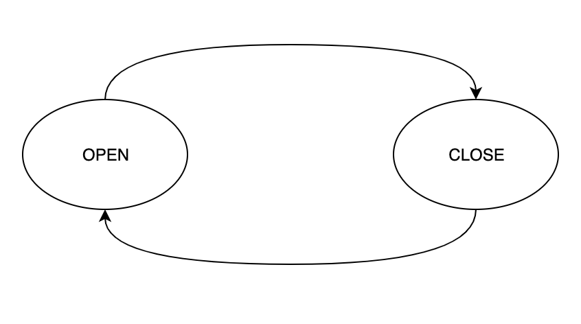
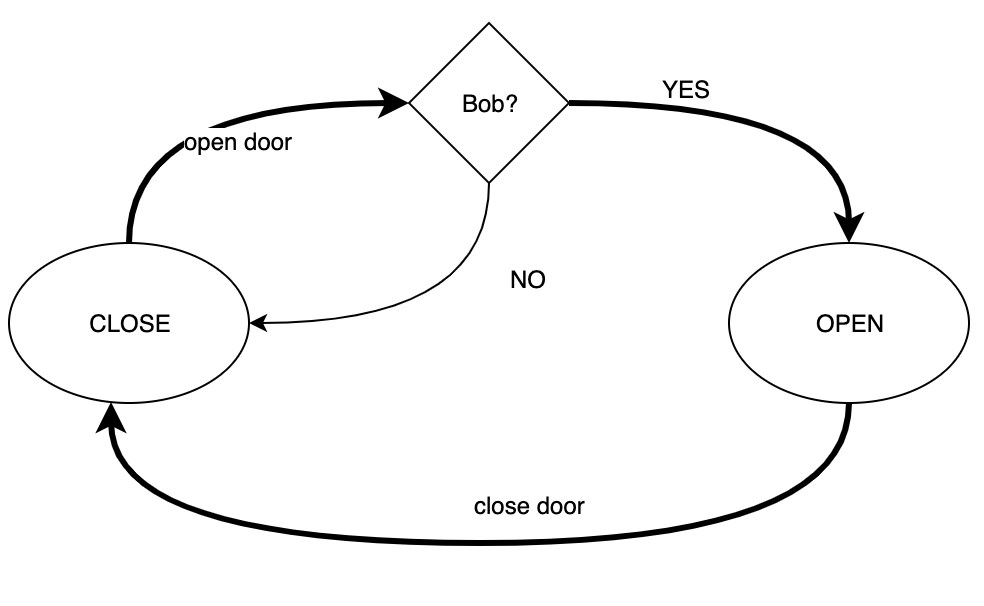

# FFSM


[](https://goreportcard.com/report/github.com/gebv/ffsm)
[](https://codecov.io/gh/gebv/ffsm)

Finite State Machine (or FSM) written in Go. It is a low-level primitive for more complex solutions. Supported (optional)  transition handler for advanced logic.

What is a finite state machine (or FSM)? TODO

* [Features](#features)
* [Quickstart](#quickstart)
* [Example code](#examples)
* [Additional packages](#additional-packages)
* [Licence](#license)

## Features

* use as [simple FSM](#simple-FSM) or with [transition handlers](#fsm-with-transition-handlers) for advanced logic
* dispatcher is thread-safe
* implemented `prometheus.Collector` for monitoring

## Quickstart

Install or update `ffsm` package.

```
go get -u github.com/gebv/ffsm
```

Simple example:

```golang
// enum of states
var (
	OpenDoor  = State("open")
	CloseDoor = State("close")
)

// setup of state transition diagram
wf := make(ffsm.Stack).Add(OpenDoor, CloseDoor).Add(CloseDoor, OpenDoor)

// init FSM with initial state CloseDoor
fsm := ffsm.NewFSM(wf, CloseDoor)

// to opens the door
err := fsm.Dispatch(context.Background(), OpenDoor)

if err != nil {
  // handler errors
}

fsm.State() // end state
```

## Examples

Finite state machine example

### Simple FSM

Can open door and close door. Opened door can not open. And closed door can not close.

Follow state transition diagram in image



On the playground https://play.golang.org/p/Z_iOnuTXOG4

<details>
  <summary>Listing code</summary>

```golang
package main

import (
	"context"
	"fmt"

	"github.com/gebv/ffsm"
)

func main() {
	// setup state transition diagram
	wf := make(ffsm.Stack).Add(OpenDoor, CloseDoor).Add(CloseDoor, OpenDoor)

	// init FSM with initial state CloseDoor
	fsm := ffsm.NewFSM(wf, CloseDoor)
	fmt.Println("initial state:", fsm.State())
	fmt.Println()

	fmt.Println("to open door")
	fmt.Println("----------------------------")
	fmt.Println("before:", fsm.State())
	err := fsm.Dispatch(context.Background(), OpenDoor)
	if err != nil {
		fmt.Println("failed:", err)
	}
	fmt.Println("after:", fsm.State())
	fmt.Println()

	fmt.Println("to open door for opened door")
	fmt.Println("----------------------------")
	fmt.Println("before:", fsm.State())
	err = fsm.Dispatch(context.Background(), OpenDoor)
	if err != nil {
		fmt.Println("failed:", err)
	}
	fmt.Println("after:", fsm.State())
	fmt.Println()

	fmt.Println("to close door")
	fmt.Println("----------------------------")
	fmt.Println("before:", fsm.State())
	err = fsm.Dispatch(context.Background(), CloseDoor)
	if err != nil {
		fmt.Println("failed:", err)
	}
	fmt.Println("after:", fsm.State())
}

const (
	OpenDoor  = ffsm.State("open")
	CloseDoor = ffsm.State("close")
)
```

</details>

### FSM with transition handlers

Only Bob can open door. Anyone can close the door. And also opened door can not open and closed door can not close.

Follow state transition diagram in image



On the playground https://play.golang.org/p/6a_wvlMTnbx

<details>
  <summary>Listing code</summary>

```golang
package main

import (
	"context"
	"fmt"
	"errors"

	"github.com/gebv/ffsm"
)

func main() {
	// handler for CloseDoor to OpenDoor transition
	onlyBobHandler := func(ctx context.Context) (context.Context, error) {
		name, ok := ctx.Value("__name").(string)
		if !ok {
			return ctx, errors.New("forbidden - only for Bob")
		}
		if name != "bob" {
			return ctx, errors.New("forbidden - only for Bob")
		}
		return ctx, nil
	}
	// setup state transition diagram
	wf := make(ffsm.Stack).Add(OpenDoor, CloseDoor).Add(CloseDoor, OpenDoor, onlyBobHandler)

	// init FSM with initial state CloseDoor
	fsm := ffsm.NewFSM(wf, CloseDoor)
	fmt.Println("initial state:", fsm.State())
	fmt.Println()

	fmt.Println("anonymous opens door")
	fmt.Println("----------------------------")
	fmt.Println("before:", fsm.State())
	err := fsm.Dispatch(context.Background(), OpenDoor)
	if err != nil {
		fmt.Println("failed:", err)
	}
	fmt.Println("after:", fsm.State())
	fmt.Println()

	fmt.Println("Bob opens door")
	fmt.Println("----------------------------")
	fmt.Println("before:", fsm.State())
	bobCtx := context.WithValue(context.Background(), "__name", "bob")
	err = fsm.Dispatch(bobCtx, OpenDoor)
	if err != nil {
		fmt.Println("failed:", err)
	}
	fmt.Println("after:", fsm.State())
	fmt.Println()

	fmt.Println("to open door for opened door")
	fmt.Println("----------------------------")
	fmt.Println("before:", fsm.State())
	err = fsm.Dispatch(context.Background(), OpenDoor)
	if err != nil {
		fmt.Println("failed:", err)
	}
	fmt.Println("after:", fsm.State())
	fmt.Println()

	fmt.Println("to close door")
	fmt.Println("----------------------------")
	fmt.Println("before:", fsm.State())
	err = fsm.Dispatch(context.Background(), CloseDoor)
	if err != nil {
		fmt.Println("failed:", err)
	}
	fmt.Println("after:", fsm.State())
}

const (
	OpenDoor  = ffsm.State("open")
	CloseDoor = ffsm.State("close")
)
```
</details>

### More examples

[See more in tests](fsm_test.go)

# Additional packages

* [github.com/prometheus/client_golang](https://github.com/prometheus/client_golang) prometheus client for golang
* [github.com/stretchr/testify](https://github.com/stretchr/testify) helper package for testing

# Version Policy

`ffsm` follows semantic versioning for the documented public API on stable releases. v1.3 is the latest stable version. Follows [changelog](./CHANGELOG.md).

# License

MIT, see [LICENSE](./LICENSE).
