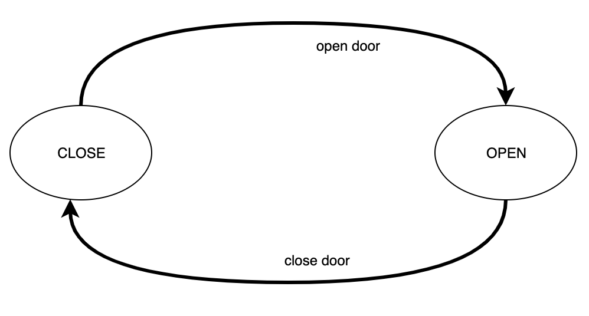

# FFSM

Finite state machine (FSM) written in Go. It is a low-level primitive for more complex solutions. Supported transition handler for advanced logic.

Working code [see more in tests](fsm_test.go)

## Features

* use as [simple FSM](#simple-FSM) or with [transition handlers](#fsm-with-transition-handlers) for advanced logic
* dispatcher is thread-safe
* implemented `prometheus.Collector` for monitoring

## Simple FSM

Can open door and close door. Opened door can not open. And closed door can not close.

Follow state transition diagram in image

TODO: on the playground
TODO: listing code

## FSM with transition handlers

Only Bob can open door. Anyone can close the door. And also opened door can not open and closed door can not close.

Follow state transition diagram in image

TODO: on the playground
TODO: listing code

# License

MIT, see [LICENSE](./LICENSE).
